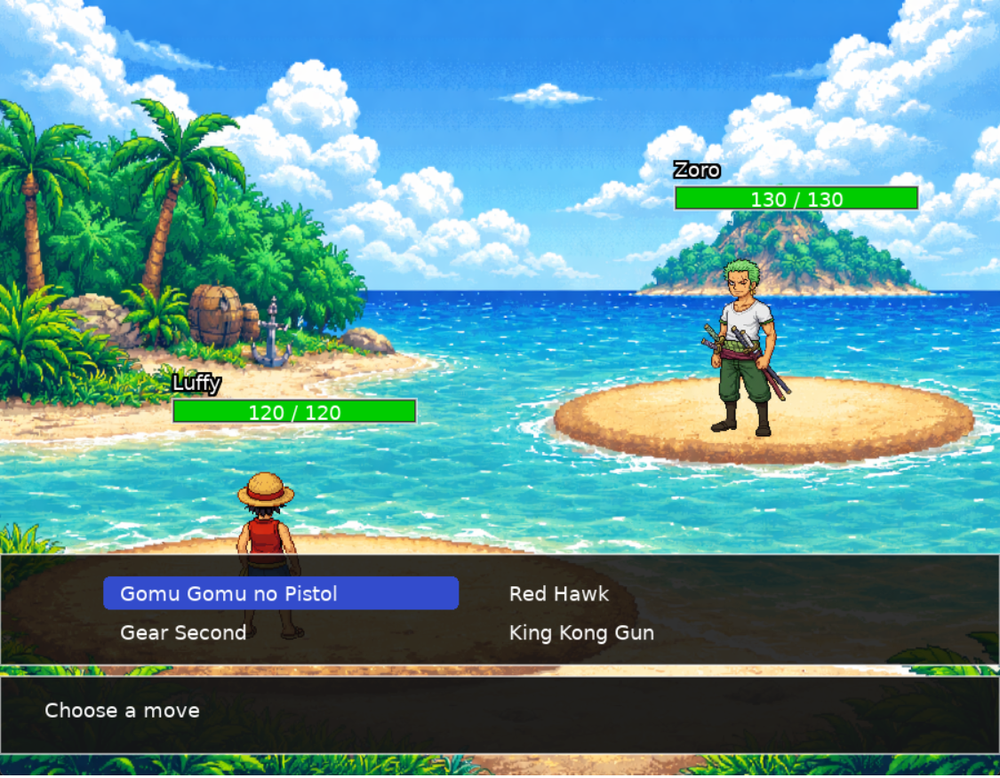

# 🏴‍☠️ One Piece Battle System

> A turn-based battle system inspired by Pokémon, developed in **Lua** using the **LOVE2D** framework, set in the One Piece universe.

---

## 🚧 Project Status

🚧 **Under Construction** 🚧  

This project is currently in active development.  
New features and improvements are being added continuously.

---

## 🎮 Overview

One Piece Battle System is a 2D turn-based combat prototype inspired by classic JRPG mechanics such as Pokémon.

The goal of the project is to explore:

- Modular game architecture
- Turn-based combat logic
- Status and buff systems
- Sprite-based rendering
- Scene management in LOVE2D

---

## 🛠 Technologies Used

- **Lua**
- **LÖVE2D**
- Object-Oriented Programming via Metatables
- Scene-based architecture
- Custom battle engine

---

## 🧠 Core Systems

### ⚔️ Turn-Based Combat
- Speed-based turn order
- Accuracy system
- Critical hit mechanics
- Randomized damage variation

### 🔥 Status Effects
- Burn
- Bleeding
- Shock (with paralysis chance)
- Sleep

Each status has:
- Duration
- Effect logic
- Automatic removal system

### 💪 Buff System
- Temporary attack boosts
- Defense multipliers
- Critical chance bonuses
- Accuracy modifiers

Buffs are:
- Stackable
- Duration-based
- Dynamically applied during damage calculation

---

## 🖼 Rendering System

- Scaled background rendering
- Dynamic sprite positioning
- Health bars with color transitions
- Outlined text rendering
- Menu navigation with keyboard arrows

---

## 🚀 How to Run

1. Install LOVE2D: https://love2d.org/
2. Clone this repository
3. Drag the project folder into the LÖVE executable  
   OR  
   Run: love .

---

## 🎯 Current Features

- Playable battle between Luffy and Zoro
- Menu navigation via arrow keys
- Turn state system
- Randomized combat engine
- Visual interface with background and sprites
- Scene transition system

---

## 🧩 Planned Improvements

- Attack animations
- Damage shake effect
- Health bar smooth animation
- Character selection screen
- AI improvements
- Experience system
- Sound effects
- Particle effects

---

## 📌 Learning Goals

This project was created to:

- Improve game architecture design
- Practice modular Lua programming
- Explore LOVE2D rendering systems
- Build a portfolio-ready game prototype

---

## 📜 License

This project is for educational and portfolio purposes only.  
One Piece is a property of Eiichiro Oda and Toei Animation.
